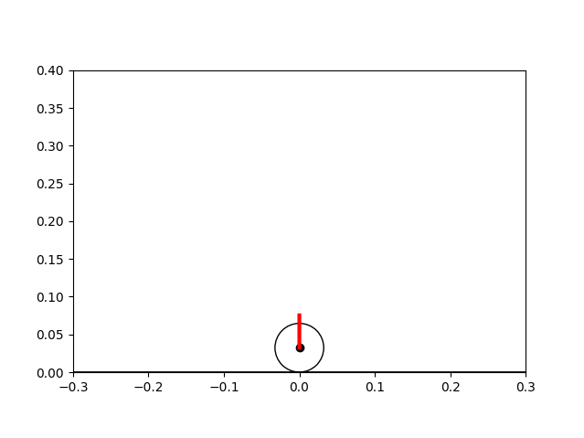
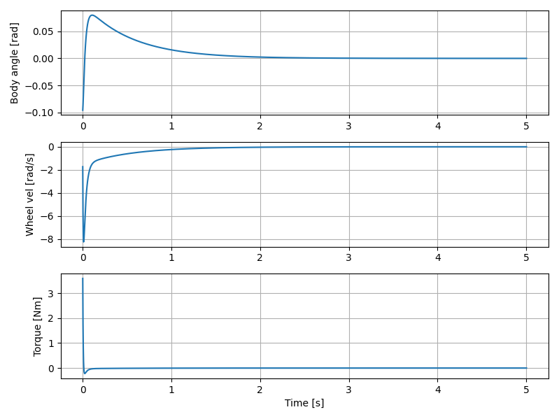
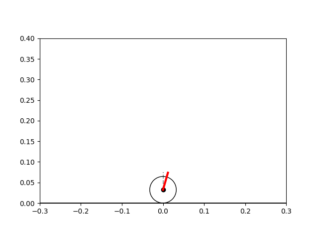
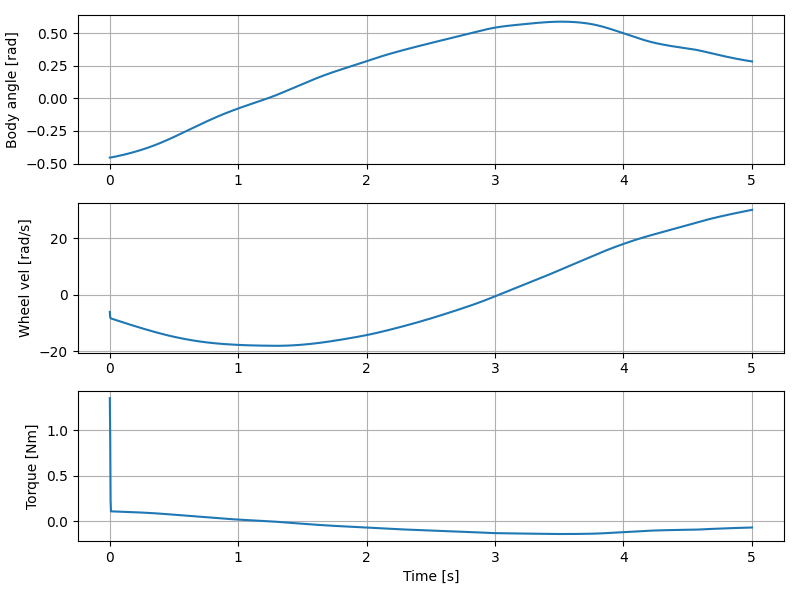

# OCRL Homework 1

---

## Part 1B

**What goes wrong when optimizing learned functions?**
Learned functions often smooth out sharp features and contain modeling errors, so optimization ends up exploiting these errors and converges to incorrect or fake minima. Gradients of the learned model can be inaccurate even when function values look reasonable.

**What goes right when optimizing learned functions?**
Learned functions can capture coarse global trends and are useful for approximate reasoning. 

**What is different from optimizing analytic functions?**
Analytic functions have exact values and gradients, so optimization follows the true geometry of the problem. Learned functions introduce approximation error that fundamentally changes the optimization landscape.

**What is your advice for using machine learning to optimize robot performance without analytic cost functions?**
Never blindly optimize a learned objective, restrict optimization to regions supported by data, and validate results against the real system.

---

## Part 2A

I used simulation-based optimization with the Nelder–Mead method to tune the four feedback gains by minimizing a rollout cost in the TWIP simulator. The optimized gains were:

$$\mathbf{K}_c = [4.75 \times 10^{-5}, 0.497, 10.15, 0.982]$$

which successfully balance the two-wheel inverted pendulum in simulation.

     
    <em>Balanced TWIP (visualize it running real time by running part2a.py)</em>

 

     
    <em>Fig 1: Optimization trajectory and cost minimization for Part 2A.</em>

---
## Part 2B: Neural Network Policy

In this section, I replaced the linear feedback controller with a non-linear Neural Network policy $\pi_{\theta}(\mathbf{s})$ trained using **Proximal Policy Optimization (PPO)**.

### Policy Objective
The goal of the policy is to maximize the expected cumulative discounted reward $E[\sum \gamma^t r_t]$. Based on the `step()` function in the environment, the reward $r_t$ at each timestep is defined as:

$$r_t = -(\theta_t^2 + 0.1 \dot{\theta}_t^2) - \mathbb{1}_{| \theta | > 1.5} \cdot 10.0$$

Where:
* $\theta$: Body angle (deviation from upright)
* $\dot{\theta}$: Body angular velocity
* $\mathbb{1}_{| \theta | > 1.5}$: An indicator function that applies a $-10.0$ penalty if the pendulum falls (angle $> 1.5$ rad).

The policy maps the state vector $\mathbf{s} = [ \phi, \dot{\phi}, \theta, \dot{\theta} ]^\top$ (where $\phi$ is wheel angle) to a torque command $u \in [-5.0, 5.0]$ Nm. Unlike the linear gain approach, the PPO policy can learn non-linear recovery behaviors to handle the wider initial state range defined in the parameters:

$$\mathbf{s}_{initial} \in \begin{bmatrix} \phi \in [\pm 30.9] \\ \dot{\phi} \in [\pm 20] \\ \theta \in [\pm \pi/4] \\ \dot{\theta} \in [\pm 20] \end{bmatrix}$$

 

     
    <em>Policy’s attempt at balancing TWIP (visualize it running real time by running part2b.py)</em>

 

     
    <em>Fig 2: State tracking and performance metrics for the learned policy showing body angle stability and control effort.</em>

